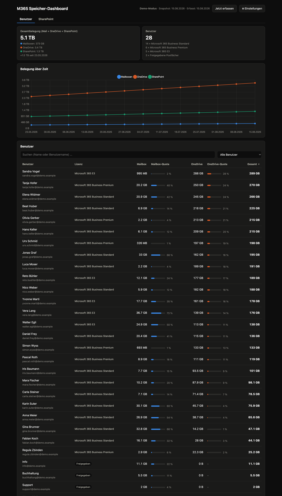
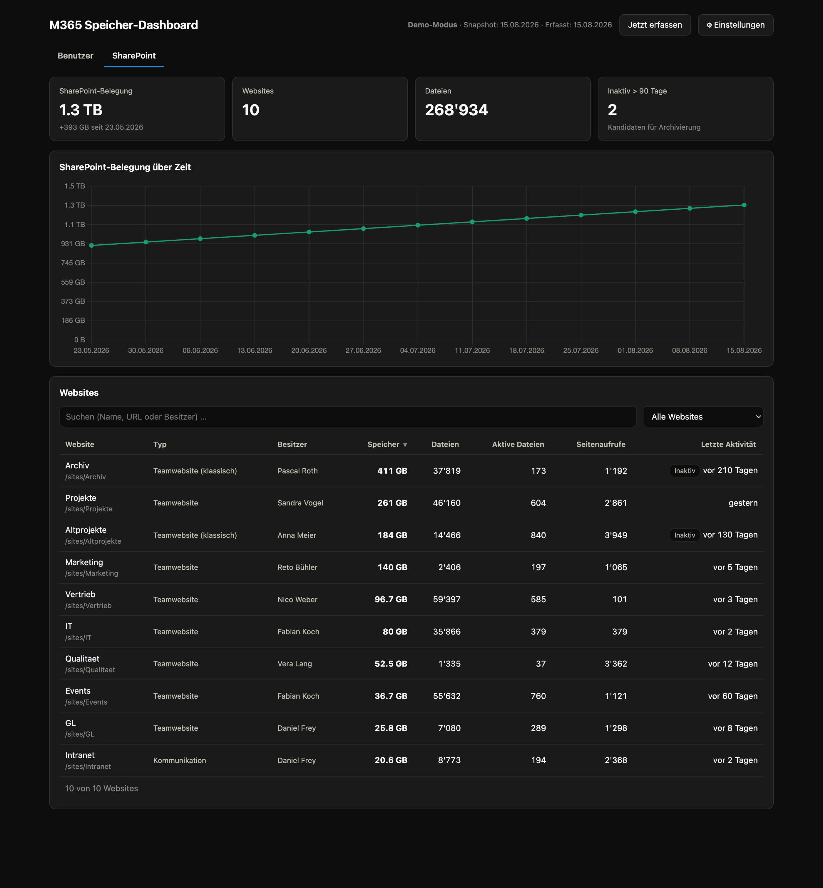

# M365 Speicher-Dashboard

🇩🇪 Deutsch (dieser Abschnitt) · 🇬🇧 [English version below](#m365-storage-dashboard-english)

OnePage-Web-App (PowerShell/Pode), die per Microsoft Graph die Postfachgrössen und
OneDrive-Belegung aller Benutzer eines Microsoft-365-Tenants ausliest, in einer
SQLite-Datenbank historisiert und als Dashboard darstellt:

- **Kacheln:** Gesamtbelegung, Mailboxen, OneDrive, Zuwachs seit Beginn sowie
  Benutzerzahl mit Aufschlüsselung pro Lizenztyp (inkl. freigegebener Postfächer)
- **Diagramm:** Belegung über Zeit (Mailbox / OneDrive getrennt, Tooltip mit Gesamt)
- **Benutzerliste:** sortierbar (Klick auf Spaltenkopf), Volltextsuche, Filter
  (Quota > 80 %, Top 10, freigegebene Postfächer), Lizenzspalte, Quota-Balken
  mit Warnschwellen (80 % / 95 %). Freigegebene Postfächer werden erkannt
  (Postfach vorhanden, Konto deaktiviert, keine Lizenz) und separat ausgewiesen
- **Einstellungen im UI:** Tenant-ID, Client-ID, Client-Secret (verschlüsselt
  gespeichert), Demo-Modus
- **SharePoint-Reiter:** alle Websites mit Speicherbelegung, Typ (Team/Kommunikation),
  Besitzer, Dateizahl, aktiven Dateien, Seitenaufrufen und letzter Aktivität;
  Inaktiv-Markierung (> 90 Tage) als Archivierungs-Kandidaten, eigener Zeitverlauf,
  Suche/Sortierung/Filter wie bei den Benutzern
- **Automatik:** eingebauter Wochen-Schedule (Standard: Montag 06:00) erfasst die
  Daten selbstständig, solange der Server läuft

## Screenshots (Demo-Modus)





## Voraussetzungen

- Windows Server oder PC (getestet auch unter macOS/Linux für Entwicklung)
- [PowerShell 7](https://aka.ms/powershell) (`winget install Microsoft.PowerShell`)
- Module: `Install-Module Pode, PSSQLite -Scope CurrentUser`
  (unter macOS/Linux wird statt PSSQLite automatisch das System-`sqlite3` benutzt)

## App-Registrierung im Kunden-Tenant (einmalig)

1. [Entra Admin Center](https://entra.microsoft.com) → **App-Registrierungen** →
   **Neue Registrierung** (Name z. B. „Speicher-Dashboard", nur dieser Tenant).
2. **API-Berechtigungen** → Hinzufügen → **Microsoft Graph** →
   **Anwendungsberechtigungen** → `Reports.Read.All`, `User.Read.All`,
   `Organization.Read.All` und `Sites.Read.All` → **Administratorzustimmung erteilen**.
   (`Reports.Read.All` ist Pflicht. `User.Read.All`/`Organization.Read.All` liefern
   Lizenztypen und die Erkennung freigegebener Postfächer; `Sites.Read.All` die
   Anzeigenamen der SharePoint-Websites, da der Usage-Report in vielen Tenants
   keine Site-URLs mehr enthält. Fehlen optionale Rechte, läuft die Erfassung
   trotzdem — das Dashboard zeigt dann einen Hinweis.)
3. **Zertifikate & Geheimnisse** → **Neuer geheimer Clientschlüssel** (Laufzeit z. B.
   24 Monate) → Wert sofort kopieren.
4. Notieren: **Verzeichnis-ID (Tenant)**, **Anwendungs-ID (Client)**, **Secret**.
5. **Wichtig — Klarnamen in Berichten:** Im
   [Microsoft 365 Admin Center](https://admin.microsoft.com) unter
   *Einstellungen → Organisationseinstellungen → Berichte* die Anzeige verborgener
   Benutzernamen **aktivieren** (Haken bei Pseudonymisierung entfernen), sonst
   liefern die Reports nur Hashes. Das Dashboard zeigt in dem Fall eine Warnung.

## Start

```bash
pwsh ./server.ps1
```

Dashboard: <http://localhost:8080> (Port in `settings.json` änderbar).
Beim ersten Start ⚙︎ **Einstellungen** öffnen, die drei Werte eintragen,
**Verbindung testen**, speichern, dann **Jetzt erfassen**.

Der **Demo-Modus** (Checkbox in den Einstellungen) erzeugt Beispieldaten mit
13 Wochen Historie — praktisch für Vorführungen ohne Tenant-Zugriff.

### Als Dauerdienst unter Windows

Am einfachsten als geplanter Task, der beim Systemstart läuft:

```powershell
Register-ScheduledTask -TaskName 'M365UsageDashboard' `
  -Action (New-ScheduledTaskAction -Execute 'pwsh.exe' -Argument '-NoProfile -File C:\Apps\m365-usage-dashboard\server.ps1') `
  -Trigger (New-ScheduledTaskTrigger -AtStartup) `
  -Settings (New-ScheduledTaskSettingsSet -RestartCount 3 -RestartInterval (New-TimeSpan -Minutes 1)) `
  -User 'SYSTEM' -RunLevel Highest
```

Hinweis: Wird der Task unter einem anderen Konto ausgeführt als dem, mit dem das
Secret gespeichert wurde, muss das Secret einmal unter diesem Konto neu gespeichert
werden (DPAPI ist benutzergebunden).

## Datenhaltung

- `data/usage.db` — SQLite; Tabelle `snapshots` mit einem Datensatz pro Benutzer
  und Snapshot-Datum (Primärschlüssel `snapshot_date, upn`), Tabelle `site_snapshots`
  analog pro SharePoint-Site (`snapshot_date, site_id`), Tabelle `meta`.
- Erfassung überschreibt denselben Tag idempotent (`INSERT OR REPLACE`) —
  mehrfaches „Jetzt erfassen" erzeugt keine Duplikate.
- `settings.json` — Konfiguration; das Client-Secret ist unter Windows per DPAPI
  verschlüsselt und wird von der API nie zurückgegeben.
- Die Graph-Reports werden von Microsoft mit ca. 24–48 h Verzögerung aktualisiert;
  das Snapshot-Datum entspricht dem „Report Refresh Date" des Reports.

## Aufbau

| Datei | Zweck |
|---|---|
| `server.ps1` | Pode-Server: statisches UI, REST-API, Wochen-Schedule |
| `src/Graph.psm1` | Token (Client Credentials) + Reports-Abruf/-Merge, Demodaten |
| `src/Storage.psm1` | SQLite-Zugriff (PSSQLite bzw. sqlite3-CLI) |
| `src/Settings.psm1` | Einstellungen laden/speichern, Secret-Verschlüsselung |
| `src/App.psm1` | Erfassungslauf + Dashboard-Datenaggregation |
| `public/` | OnePage-Frontend (Vanilla JS + Chart.js, lokal gebündelt) |

### API

| Route | Zweck |
|---|---|
| `GET /api/data` | Status + Historie + aktuelle Benutzerliste |
| `GET/POST /api/settings` | Konfiguration lesen/schreiben (Secret nur schreibend) |
| `POST /api/test` | Verbindungstest (Token-Abruf) |
| `POST /api/collect` | Erfassung sofort ausführen |

## Unterstützung

Das Dashboard ist kostenlos und Open Source — von Nutzern für Nutzer.
Wer das Projekt unterstützen möchte:

[](https://buymeacoffee.com/timme)

---

# M365 Storage Dashboard (English)

Single-page web app (PowerShell/Pode) that reads mailbox sizes, OneDrive usage and
SharePoint site storage for an entire Microsoft 365 tenant via Microsoft Graph,
stores the history in a SQLite database and presents it as a dashboard:

- **Tiles:** total tenant storage (mail + OneDrive + SharePoint) with the three
  shares broken out, growth since the first snapshot, and user count broken down
  by license type (incl. shared mailboxes)
- **Chart:** storage over time — mailboxes, OneDrive and SharePoint as separate
  lines, tooltip shows the total
- **User list:** sortable (click a column header), full-text search, filters
  (quota > 80 %, top 10, shared mailboxes), license column, quota bars with
  warning thresholds (80 % / 95 %). Shared mailboxes are detected automatically
  (mailbox present, account disabled, no license) and shown separately
- **SharePoint tab:** all sites with real display names, storage, type
  (team/communication), owner, file count, active files, page views and last
  activity; sites inactive for more than 90 days are flagged as archiving
  candidates; separate growth chart; search/sort/filter like the user list
  (deep link: `#sharepoint`)
- **Settings in the UI:** tenant ID, client ID, client secret (stored encrypted
  via DPAPI on Windows), demo mode with generated sample data
- **Automation:** built-in weekly schedule (default: Monday 06:00) collects a new
  snapshot as long as the server is running

Screenshots (demo mode) are shown [above](#screenshots-demo-modus).

## Requirements

- Windows server or PC (development also tested on macOS/Linux)
- [PowerShell 7](https://aka.ms/powershell) (`winget install Microsoft.PowerShell`)
- Modules: `Install-Module Pode, PSSQLite -Scope CurrentUser`
  (on macOS/Linux the system `sqlite3` CLI is used instead of PSSQLite)

## App registration in the customer tenant (one-time)

The `setup/` folder contains a step-by-step guide (PDF, German) and PowerShell
scripts that automate the whole process:

- `01-register-app.ps1` — creates the app registration, service principal,
  all Graph permissions incl. admin consent and a client secret, then prints
  the three values the dashboard needs
- `02-get-ids.ps1` — reads tenant ID / client ID of an existing registration,
  lists secret expiry dates and verifies all permissions; `-Fix` assigns any
  missing app roles directly (more reliable than the portal's consent button,
  which can silently revoke existing grants)
- `03-report-settings.ps1` — checks report pseudonymization and disables it on
  request (`-Force` for non-interactive use)

Manual portal setup works too: register an app (single tenant), add the Graph
**application** permissions below, grant admin consent, create a client secret.

| Permission | Purpose | Required? |
|---|---|---|
| `Reports.Read.All` | usage reports: mailbox, OneDrive and SharePoint storage | yes |
| `User.Read.All` | per-user license assignments, shared-mailbox detection | recommended |
| `Organization.Read.All` | license master data (SKU names) | recommended |
| `Sites.Read.All` | SharePoint site display names and URLs (the usage report no longer includes site URLs in many tenants) | recommended |

If the optional permissions are missing, storage collection still works — the
dashboard shows a hint and leaves the affected columns empty.

**Important — real names in reports:** Microsoft pseudonymizes usage reports in
many tenants by default (hashes instead of names and site URLs). Disable this
once in the [Microsoft 365 Admin Center](https://admin.microsoft.com) under
*Settings → Org settings → Reports*, or run `03-report-settings.ps1`. The
dashboard detects concealed reports and shows a warning.

## Getting started

```
pwsh ./start.ps1
```

Dashboard: <http://localhost:8080> (port configurable in `settings.json`).
On first start, open ⚙︎ **Settings**, enter the three values, click
**Test connection**, save, then **Collect now**. `stop.ps1` stops the server.
The **demo mode** checkbox generates 13 weeks of sample data — handy for a
first look without any tenant access.

To run permanently on Windows, register a scheduled task at system startup
(see the German section above for a ready-made `Register-ScheduledTask` call).

## Data storage

- `data/usage.db` — SQLite; one row per user and snapshot date
  (`snapshots`), one row per SharePoint site and snapshot date
  (`site_snapshots`), plus a `meta` table
- Collections are idempotent (`INSERT OR REPLACE`) and serialized — collecting
  twice on the same day never creates duplicates
- `settings.json` — configuration; the client secret is DPAPI-encrypted on
  Windows and is never returned by the API
- Graph usage reports lag by roughly 24–48 h; the snapshot date is the report's
  "Report Refresh Date"

## Architecture

| File | Purpose |
|---|---|
| `server.ps1` | Pode server: static UI, REST API, weekly schedule |
| `src/Graph.psm1` | token (client credentials), report fetching/merging, site names, demo data |
| `src/Storage.psm1` | SQLite access (PSSQLite or sqlite3 CLI) |
| `src/Settings.psm1` | settings load/save, secret encryption |
| `src/App.psm1` | collection run + dashboard data aggregation |
| `public/` | single-page frontend (vanilla JS + bundled Chart.js) |

### API

| Route | Purpose |
|---|---|
| `GET /api/data` | status + history + current user and site lists |
| `GET/POST /api/settings` | read/write configuration (secret is write-only) |
| `POST /api/test` | connection test (token acquisition) |
| `POST /api/collect` | run a collection immediately |

## Support

The dashboard is free and open source — built by users, for users.
If it saves you a few francs in backup costs:

[](https://buymeacoffee.com/timme)
